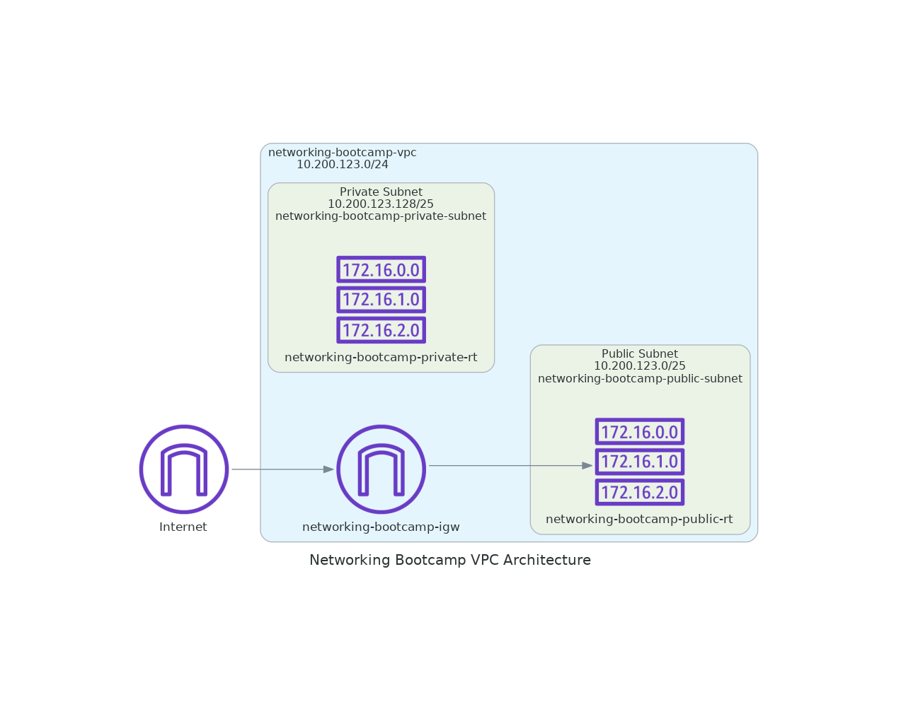
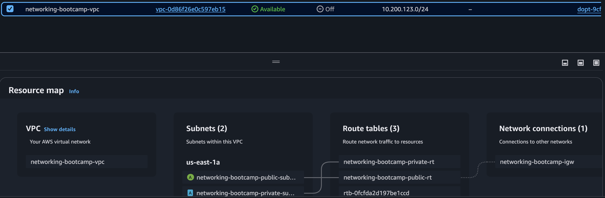
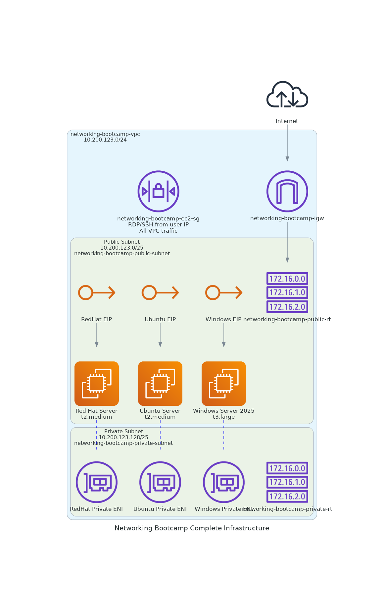
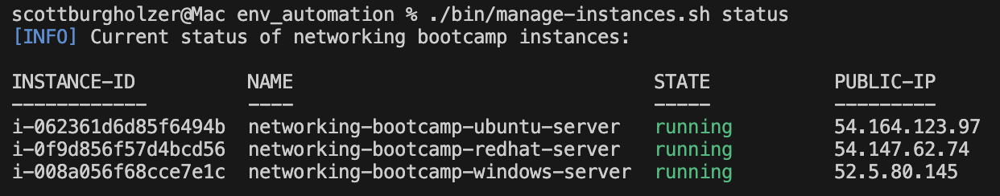
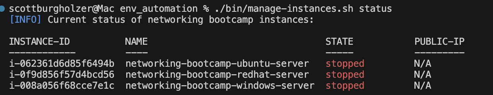

# Automating Setting up AWS Account for the bootcamp labs

This is taking what we did in [Setup Cloud Environment](../../Journal/Week1.md#setup-cloud-environment), which was click ops, and automating it, in my case I choose to automate in Terraform/openTofu. Additionally, I utilized Amazon Q CLI to assist me in ensuring I set up my .tf files correctly to avoid as many forgetful moments as possible. I did this full well knowing LLMs are not always right and knew that I would most likely have to deal with bugs/issues from the LLM's code. As someone who does this daily to speed up my development in multiple ways, not just generating code, I am comfortable dealing with dealing with LLM's and their not always correct responses.


## Design Decisions

We will be using AWS S3 to store our state file, and will be using the S3 Object Locking to do everything in S3 and not have to worry about a DynamoDB table. This S3 bucket I created manually as in my opinion it is easier, and also ensures that if we accidentally run terraform destroy when we didn't mean to, that we don't loose the bucket, especially if you decide to have one bucket for all state files.

Given this is a bootcamp, and more of a lab environment to understand networking, I have decided I will have everything in one .tf file for simplicity. Additionally as we are not worried about Multi-Region, Multi-AZ, multi-environment, I will not worry about breaking my project into regions and environments.

I'm using openTofu v1.10.0-rc1 to get the S3 object locking feature. As this is not a production workload, I am comfortable using a release candidate for this project.

We will be using a shared Security group for this bootcamp just for ease. This may not be wanted in a production workload.

## VPC Settings

These are the VPC Settings we observed Tim setup for our cloud environment in AWS:

- VPC IPv4 CIDR Block: 10.200.123.0/24
- Ipv6 CIDR Block: No
- Number of AZs: 1
- Number of public subnets: 1
- Number of private subnets: 1
- NAT GATEWAYS: None
- VPC Endpoints: None
- DNS Options: Enable DNS Hostnames
- DNS options: Enable DNS Resolution

### Network Diagrams

AWS Q AWS Diagram MCP generated Diagram:



AWS VPC Console Resource Map:




## EC2 Settings

- Windows Sever
- Ubuntu Server
- Red Hat Server
- The three above servers in public subnet
- The three above servers getting Elastic IPs assigned to them
- The three above servers also having an ENI interface in the private subnet
- Security Group allowing all traffic from the VPC, RDP from the user's IP and SSH from the user's IP

### Network Diagram with EC2, EIP and ENIs added



Some text overlaps other text, for a production workload I'd work on getting the MCP diagram server to fix that.

### Errors Ran Into
- I forgot to release the Elastic IPs from the clickOps version, so the apply failed as I had reached my quota (which if I needed to, I could request an increase in), but as I don't need to request an increase, I just released those Elastic IPs and ran the apply again to get all new Elastic IPs.


## Additional Info

### Additional uses of LLM

- Used it to confirm my HCL blocks for configuring VPC and EC2 settings
- Used it to create a .gitignore for Terraform/openTofu
- Used AWS Diagram MCP to generate a diagram of the network.


### Issues with LLM

- It didn't remember it had to use ```use_lockfile = true``` in the backend block
- In the diagram generated by the AWS Diagram MCP, it showed 172.16.0.0 like IPs within the subnets, which didn't match the subnet CIDR ranges, and at the time of generation, no EC2 instances were in there yet, so wasn't quite what I was looking for. I probably could of prompted my way out of that to something different, but I'm wanting to show what happens with what I initially give it and move on for the purposes of this bootcamp. In a production project I would really focus on getting the diagrams just right, but knowing me, I'll take a long time on it and it's honestly not worth it for this bootcamp, I'd rather focus on the networking stuff. Ok, I later came back to it and realized the 172.16.0.0 IPs are just the icon for routetable, the IPs shown don't mean anything. Would it be nice to be related to the subnet CIDRs? yes, but it's a quirk with the AWS Diagram MCP.

### Script to Start/Stop/Monitor the EC2 Instances

There is a script called manage-instances.sh in the bin folder that takes the arguments of start, stop, status. The start argument will start all three instances, the stop will stop all three and status will get the status of all three. It is also color coded.


