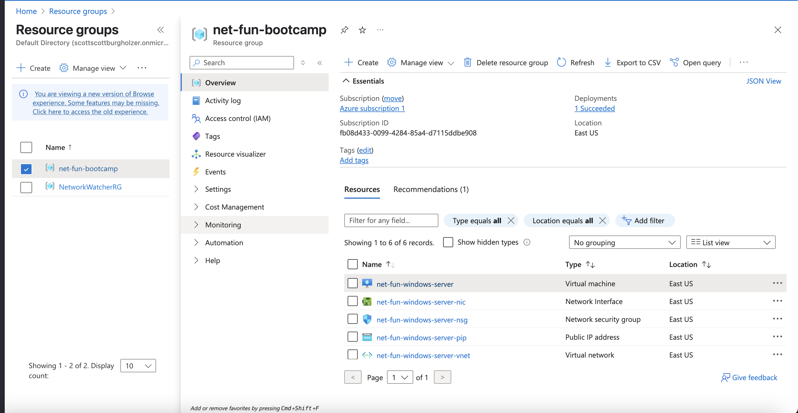
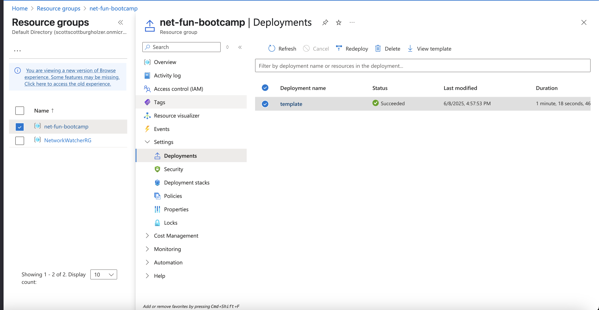

# IP Address Management with Azure

The only thing I have ever done in Azure is EntraID and that is for my Company's Microsoft 365 Tenant directory, otherwise I have no experience with Azure. This is the first time I've spun up a VM or anything in Azure. As such, I'm taking a bit more detailed notes for this project to help me remember if I ever need to use this again!

## Steps to manually deploy and then start working on IaC
- Setup Virtual Machine in Azure
    - for availability options, for our use case in this bootcamp, we will select ```No infrastructure redundancy required```
    - for security type, ```Trusted launch virtual machines```
    - for image, ```Windows Server 2025 Datacenter Server Core - x64 Gen2```
    - left RDP port enabled
    - left disk info as default
    - in networking, ensured we had a Public IP address (the virtual network was already created for us, for me I manually had to press create new for public ip)
    - selected the option to get rid of the Public IP and NIC upon VM deletion
    - Upon telling Azure to create the VM, there is a template tab that gives us the template used to create the VM. We are able to download this.
    - Downloaded the template and put the files in [templates/vm](templates/vm/)
    - When we logged into the VM, we had command prompt only and were unsure what to do, so we deleted the resource group and decided to start fresh, but from the template.
    - We decided to use Azure Bicep which required us to convert our template.json file.
    - We do need to install the Azure CLI
        - As I am on Mac and have Homebrew I installed via Homebrew
        - ```brew update && brew install azure-cli```
        - 

## Steps to convert ARM to Bicep and deploy via Bicep
- Login to azure ```az login``` this worked directly for me as I'm on Mac
- Ensure you are in [templates/vm](templates/vm/) in the terminal and then run ```az bicep decompile --file template.json```
- Installed the Microsoft Bicep VSCode Extension
- Used LLM to simplify the Bicep file even more as it is a 1:1 representation of the template.json when you run the decompile command (still very verbose)
- Made the imageRefence section use parameters.
- I diverge from the video here, I still want to use Windows Server 2025, but with Desktop. I have Perplexity Pro subscription and asked it what image would I want to use. It told me that when we use the Core version it does not have a desktop interface, so we would want to select one that says Server with Desktop Experience.
    - So perplexity was not fully correct, I didn't see anything that said Server with Desktop Experience, however I did find ```Windows Server 2025 Datacenter: Azure Edition - x64 Gen2``` and I manually deployed it to check, and it did indeed have a desktop!
- Kept getting ```The content for this response was already consumed``` error messages, used Amazon Q CLI to assist in debugging
    - First suggested to create the resource group manually, then deploy the bicep file, didn't help
    - Suggested to run ```az deployment group validate --resource-group net-fun-bootcamp --template-file template.bicep --parameters @parameters.json``` and same error
    - In my parameters.json file, the Admin Password was null, but it is a required parameter for Azure, Amazon Q suggest making it a command line parameter instead. So added ```--parameters adminPassword='YourSecurePassword123!'``` to the deploy command. This made the command successful and everything was deployed!


### Why use Azure Bicep over the ARM Templates?
One of the top reasons to use Bicep over the ARM template we downloaded is that Bicep gives us improved readability and maintainability. It also gives a better developer experience over ARM. There are other benefits, but for our use case for the bootcamp, these are the main two benefits of using Bicep over ARM.

### Result Screen of Manual Deployment


### Resource Group Created from README Deploy Steps




### Final Thoughts

I personally find AWS much easier to work with, even if I were to use only the cloud provider's IaC (CloudFormation and Bicep for example). This entire project probably would of been much easier in terraform. I may revisit this and complete it in Terraform, but at least I was able to get Bicep to work!