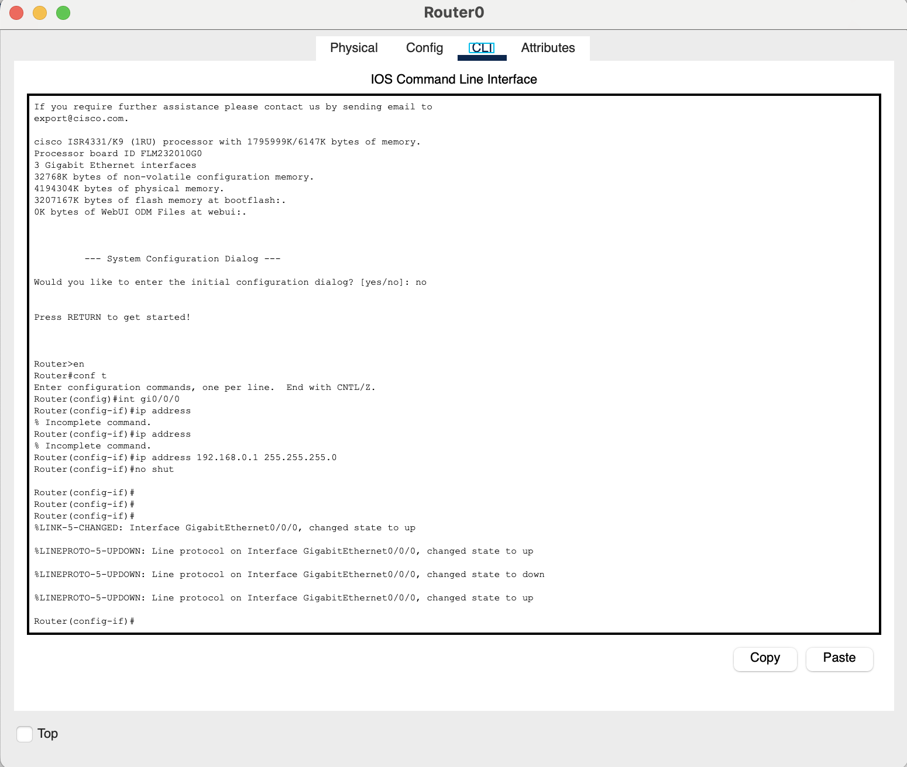
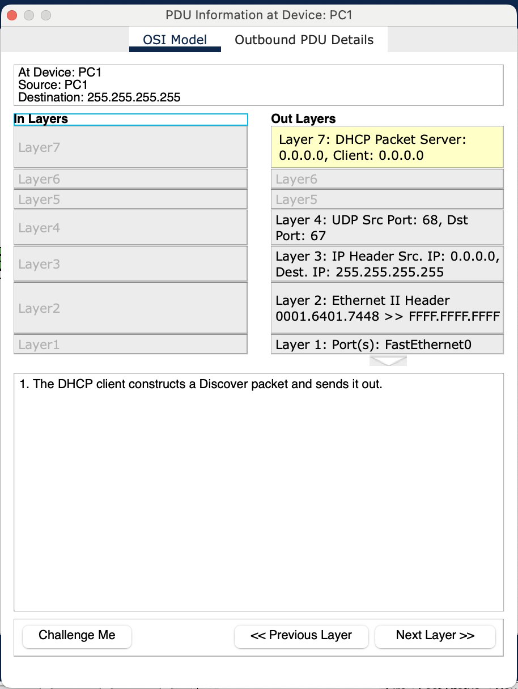
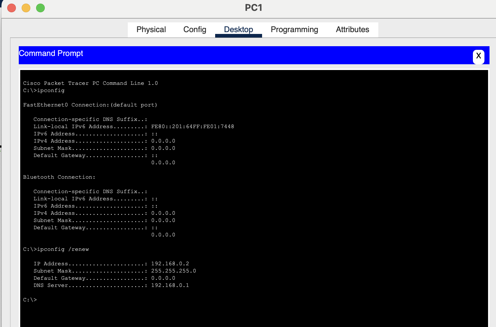
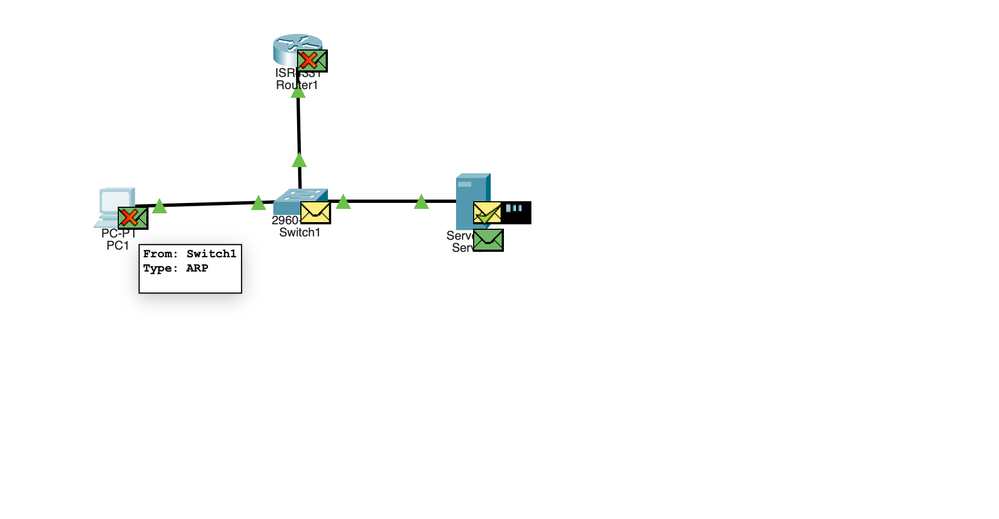
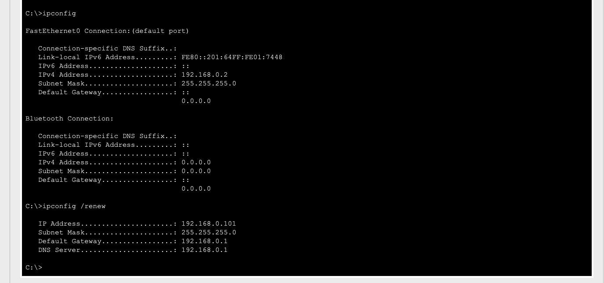

# Building a Basic Network in Packet Tracer/Learning How to Use Packet Tracer

The Devices we added to our simulation network were:
- Router
- Switch
- PC
- Server (will be DHCP Server)

Once we had all devices added to packet-tracer, we went to the connection tool and selected copper straight through as that is Ethernet cables.

We then clicked on the router and went to the CLI and did some basic setup

We then clicked on our server to setup DHCP. In the Config tab, we set Gateway DNS IPv4 to have default gateway and DNS server of the router (192.168.0.1). But now we want our DHCP server to have a static IP address, so within the config tab we select FastEthernet0 and set the IPv4 Address to 192.168.0.100 (for our simulated network) and it auto-populated the correct subnet mask. We then went to the Services Tab, clicked on DHCP, turned the service on, put the router IP in as Default Gateway and DNS Server, and for our example dis the start IP address as 192.168.0.101 and set the maximum number of users to 100.

We then click on the PC, click on Desktop tab and click on Command Prompt. We run ipconfig and see there is no IP address yet. We run a ipconfig /renew to get an IP and in packet-tracer we see the request ready to send.

With DHCP there are four steps called DORA (Discover, Offer, Request, Acknowledge)

DHCP Discover Message (does anyone on the network have an IP they can assign to me?):

    - Layer 7: Does anyone have a DHCP IP to give me?
    - Layer 4: Uses specific Ports for this message
    - Layer 3: As IP is 0.0.0.0 and Destination IP is 255.255.255.255, this is a Broadcast packet (I don't know who I'm sending this traffic too as I know nothing about the network yet, so I'm asking every single device on the network that can hear me)
    - Layer 2: Destination Hardware address (All Fs, as it's a broadcast packet)
    - Layer 1: Going out the only interface on the PC

We also went over the Outbound PDU Details. This is the Ethernet specification frame that every packet has so each Ethernet device can read it.

The next step is the packet going to the switch. The switch looks at the packet, sees it's a broadcast packet and will distribute it across all active ports it has, except for the port that it received the packet from.

DHCP Offer Message:

The DHCP Server sends back an IP address offer to the PC with all the necessary info (such as the IP it's offering, gateway IP, DNS IP)

DHCP Request Message:

The PC gets that offer message and sends back a request to officially get that IP address from the DHCP server.

DHCP Acknowledge Message:

The server gets that request, and as long as that IP is still available, it'll acknowledge the PC request and say yes this is now officially your IP address.

#### Notes:
- I did have an ARP (Address Resolution Protocol) packet going the same time as my DHCP broadcast packet, not that it really matters, but made it a little more confusing on my part, but I managed to get through it. We actually discuss this in the video!
    - ARP is when we know the IP of something, but we don't know how to get there, doesn't know the physical address at layer 2.

- As Tim figured out near the end of the video, and I kind of figured out right before he did, we had some weird DHCP issues, and that's because we couldn't rename the existing DHCP pool, and thus created two DHCP pools, but the DHCP server was still using the default pool it came with. I went back, deleted the pool we created, updated the existing pool to have the right Gateway IP and DNS IP and changed the starting IP to be 192.168.0.100 and ipconfig on the pc (after restarting simulation) looked correct to me.
