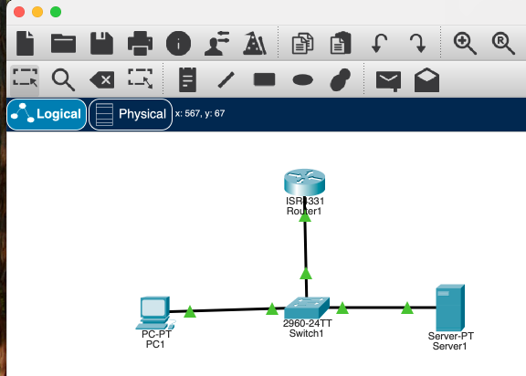

# Packet Tracer Basic Network Lab

## Network Topology

This project demonstrates a basic network setup in Cisco Packet Tracer consisting of four main components:

### Network Components:
- **Router (192.168.0.1)**: Central routing device that serves as the default gateway
- **Switch**: Layer 2 switching device connecting all end devices
- **PC**: Client workstation configured to receive IP via DHCP
- **Server (192.168.0.100)**: DHCP server providing automatic IP configuration

### Network Configuration:
- **Network Subnet**: 192.168.0.0/24
- **Router IP**: 192.168.0.1 (Default Gateway & DNS Server)
- **DHCP Server IP**: 192.168.0.100 (Static)
- **DHCP Pool**: 192.168.0.101 - 192.168.0.200 (100 addresses)
- **Connection Type**: Copper straight-through Ethernet cables

## Lab Summary

This lab focused on building a basic network in Packet Tracer and understanding fundamental networking concepts, particularly the DHCP process.

### Key Learning Objectives:
1. **Device Configuration**: Set up router, switch, PC, and DHCP server
2. **DHCP Implementation**: Configure automatic IP address assignment
3. **Network Connectivity**: Establish communication between devices using Ethernet connections
4. **Protocol Analysis**: Understand the DHCP DORA process

### DHCP Process (DORA):
The lab demonstrated the four-step DHCP process:

1. **Discover**: PC broadcasts request for IP address (0.0.0.0 → 255.255.255.255)
2. **Offer**: DHCP server responds with available IP address and network configuration
3. **Request**: PC formally requests the offered IP address
4. **Acknowledge**: DHCP server confirms IP assignment

### Configuration Steps:
1. **Router Setup**: Basic CLI configuration for routing functionality
2. **DHCP Server Configuration**:
   - Set static IP address (192.168.0.100)
   - Configure DHCP service with router as gateway/DNS
   - Define IP pool starting at 192.168.0.101
3. **PC Configuration**: Used `ipconfig /renew` to obtain IP via DHCP

### Key Observations:
- Switch forwards broadcast packets to all active ports except the source port
- ARP (Address Resolution Protocol) packets may appear alongside DHCP traffic
- Proper DHCP pool configuration is critical for successful IP assignment
- Packet Tracer provides detailed PDU analysis for understanding network communication

### Troubleshooting Notes:
- Initial DHCP issues were resolved by properly configuring the default DHCP pool
- Multiple DHCP pools can cause conflicts if not managed correctly
- Network simulation restart may be required after configuration changes

This lab provides a foundation for understanding basic network operations and serves as a stepping stone for more complex networking scenarios.

[Here are my notes I took while going through the lab](Journal.md)