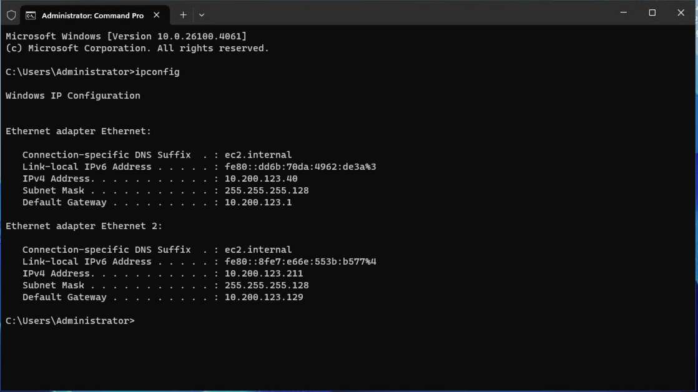
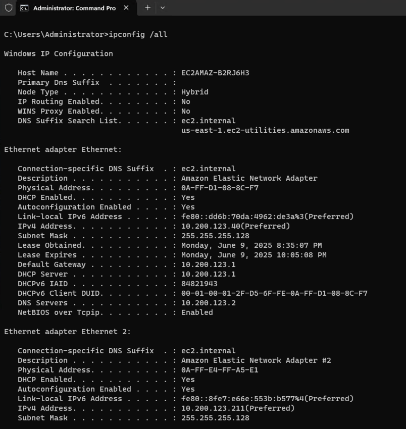

# Windows Networking Tools

- ipconfig
    - command used to do IP configurations in Windows
    - ```ipconfig``` by itself gives us just basic information about our adapters
        
    - ```ipconfig /?``` shows all the options you have to use with the command
    - ```ipconfig /all``` this will display the full configuration information for a deeper dive into the network configuration for your pc.
        
    - ```ipconfig /release``` Will instruct the DHCP client to release the current IP address, the network adapter will thus loose the IP and no longer be able to communicate on the network. IP, Default Gateway, Subnet Mask and DNS IP will all be set to 0.0.0.0. Often used for troubleshooting network connectivity issues, forcing a new IP address assignment and resolving IP address conflicts. Often run ```ipconfig /renew``` after running this command.
    - ```ipconfig /renew``` Will instruct the DHCP client to request a new IP address, subnet mask, default gateway and DNS server information. If the network adapter's request for this new information is successful, the computer will get all new network configuration information and restore network connectivity. This is commonly used after running ```ipconfig /release```, when troubleshooting network connectivity issues, moving between networks or if there is a need to force an update of network settings provided by DHCP.
    - ```ipconfig /flushdns``` This will purge the DNS resolver cache on the computer. This will force your computer to then perform new DNS lookups for any domains you try to access after running this command. This command is useful when you have changed DNS records yourself and want to ensure you are getting the correct information, you are experiencing issues accessing websites that should be available, you think the DNS cache has outdated or corrupted entries or you are troubleshooting name resolution problems. I asked Amazon Q CLI if it automatically purges itself, and as I suspected, it will use the Time to Live (TTL) values to purge each individual entry.
    - ```ipconfig /registerdns``` This will force the computer to re-register all of its DNS records with the configured DNS Server. This will include forward (hostname to IP) and reverse (IP to hostname) DNS records. Unlike some of the other options for ipconfig, this one does not return a visual feedback when successful. This is a useful command for times where you have changed the computer's hostname, the IP address has changed, theres issues with name resolution or you just want to ensure the computer's DNS records are up-to-date.

- ping
    - ```ping google.com``` This is a network utility tool that tests the reachability of a host on an IP network and measures the round-trip time for messages sent from the originating host to the destination computer. You can ping domains (google.com) or IPs (8.8.8.8).
    - ```ping -a 8.8.8.8``` this option with an ip address (8.8.8.8 is an example) adds hostname resolution to the standard ping functionality. So you get the same info as a regular ping, but you will also get the hostname of that IP (which may or may not match the domain name!)
    - ```ping -l 1000 google.com``` This just increase the byte size you are sending with each request
    - ```ping -f -l 1800 google.com``` the -f option tells ping to not fragment the packet. Ethernet packet sizes are 1500 bytes, and 1800 is bigger than that, so ethernet is unable to process it unless fragmented.

- Trace Route
    - ```tracert``` This is a network diagnostic command used to track the path that packets will take from your computer to a destination host. It'll show the route and measures the transit delay of packets across an IP network. 
        
        The Process is as follows:
        
            1. sends a series of ICMP packets with incrementing TTL
            2. Each router along the path will decrement the TTL by 1
            3. When a packet's TTL reaches zero, the router returns an ICMP "Time Exceeded" message
            4. this process reveals each hop (router) in the path to the destination
    
    - This command is useful for identifying where network delays occur, troubleshooting network connectivity issues, determining the path your traffic takes to reach a destination and for identifying potential network bottlenecks.
    - NOTE: not all routers allow this type of ICMP request, so those will show * and Request timed out.

- nslookup
    - ```nslookup``` is a command line tool used to query DNS servers to obtain domain name and/or IP address mapping information. The primary use is for diagnosing DNS related problems and troubleshooting DNS infrastructure.
    - It'll query DNS servers to retrieve information about domain names, IP Addresses and any type of DNS record. By default it uses the computer's configured DNS server, but you can change that, and it has an interactive and non interactive mode.
    - This tool is useful for verifying DNS records are configured correctly, to see if DNS changes have propagated, testing DNS server functionality for a few examples.

- netstat
    - ```netstat``` This is a command line tool that can display network connections, routing tables, interface statistics, and other information. ```netstat``` alone shows all active connections to the computer and their states. Using different options we can also display which programs are using which ports and it can also provide information about network interfaces and routing tables.
    - Here are some common options per Amazon Q CLi:
        ```text
            -a: Shows all connections and listening ports
            -n: Displays addresses and port numbers in numerical form (doesn't resolve hostnames)
            -p: Shows the process ID and name using each connection (requires admin privileges)
            -r: Displays the routing table
            -s: Shows statistics by protocol (TCP, UDP, ICMP, etc.)
            -t: Shows only TCP connections
            -u: Shows only UDP connections
        ```

- route
    - ```route``` This is a network utility that is used to view and manipulate the IP routing table on the computer. It allows you to display, add, delete, or modify routes that determine how network traffic is directed.
    - ```route print``` will display the routing table
    - ```route add``` will add a new route to the table, this won't persist across reboots. If you want to add a route to persist you need to use ```route add 157.0.0.0 MASK 255.0.0.0 10.200.200.1 IF 3 -p``` for example
    - ```route delete``` will delete a route from the table
    - ```route change``` will modify an existing route in the table


#### Notes:
- I keep forgetting my default profile for my terminal is my work profile and not my personal profile which I am using for this bootcamp, so as such when I ran the [manage-instances.sh](../env_automation/bin/manage-instances.sh) script to start the instances back up ```./manage-instances.sh start```, it kept saying no instances found with the project tag. I eventually remembered I had to run export AWS_PROFILE=default (I haven't named it differently) to use my personal AWS account.