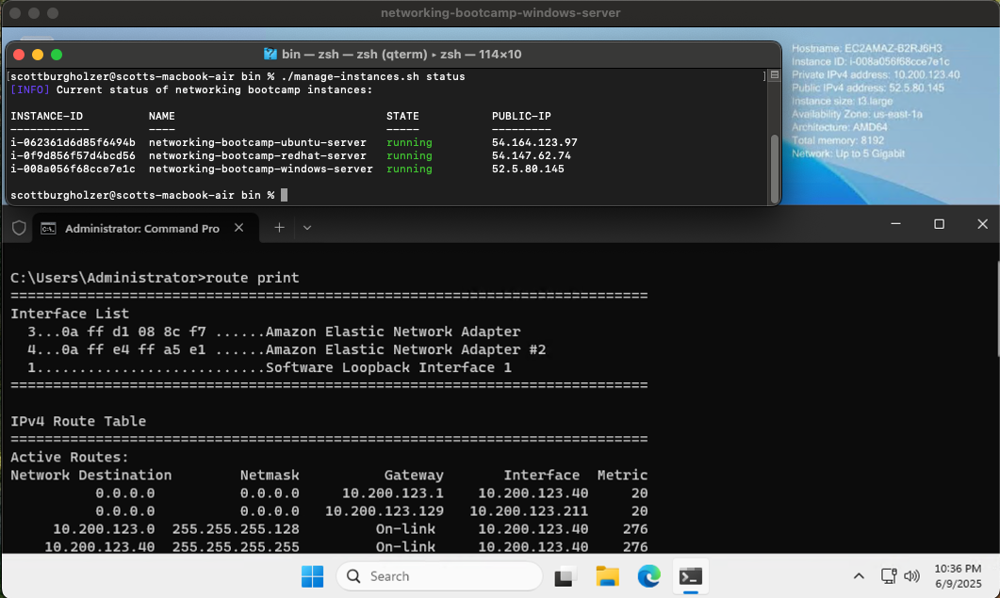

## Developer Environment



The environment is managed through AWS using a personal AWS account, with instances and VPC managed by openTofu in [env_automation](../env_automation/). The Manage Instances script can be found at [env_automation/bin/manage-instances.sh](../env_automation/bin/manage-instances.sh) for proof of how that script gets the state of the instances.

## IPConfig

```text
ipconfig

Windows IP Configuration


Ethernet adapter Ethernet:

   Connection-specific DNS Suffix  . : ec2.internal
   Link-local IPv6 Address . . . . . : fe80::dd6b:70da:4962:de3a%3
   IPv4 Address. . . . . . . . . . . : 10.200.123.40
   Subnet Mask . . . . . . . . . . . : 255.255.255.128
   Default Gateway . . . . . . . . . : 10.200.123.1

Ethernet adapter Ethernet 2:

   Connection-specific DNS Suffix  . : ec2.internal
   Link-local IPv6 Address . . . . . : fe80::8fe7:e66e:553b:b577%4
   IPv4 Address. . . . . . . . . . . : 10.200.123.211
   Subnet Mask . . . . . . . . . . . : 255.255.255.128
   Default Gateway . . . . . . . . . : 10.200.123.129
```
```text
ipconfig /all

Windows IP Configuration

   Host Name . . . . . . . . . . . . : EC2AMAZ-B2RJ6H3
   Primary Dns Suffix  . . . . . . . :
   Node Type . . . . . . . . . . . . : Hybrid
   IP Routing Enabled. . . . . . . . : No
   WINS Proxy Enabled. . . . . . . . : No
   DNS Suffix Search List. . . . . . : ec2.internal
                                       us-east-1.ec2-utilities.amazonaws.com

Ethernet adapter Ethernet:

   Connection-specific DNS Suffix  . : ec2.internal
   Description . . . . . . . . . . . : Amazon Elastic Network Adapter
   Physical Address. . . . . . . . . : 0A-FF-D1-08-8C-F7
   DHCP Enabled. . . . . . . . . . . : Yes
   Autoconfiguration Enabled . . . . : Yes
   Link-local IPv6 Address . . . . . : fe80::dd6b:70da:4962:de3a%3(Preferred)
   IPv4 Address. . . . . . . . . . . : 10.200.123.40(Preferred)
   Subnet Mask . . . . . . . . . . . : 255.255.255.128
   Lease Obtained. . . . . . . . . . : Monday, June 9, 2025 8:35:07 PM
   Lease Expires . . . . . . . . . . : Monday, June 9, 2025 11:05:11 PM
   Default Gateway . . . . . . . . . : 10.200.123.1
   DHCP Server . . . . . . . . . . . : 10.200.123.1
   DHCPv6 IAID . . . . . . . . . . . : 84821943
   DHCPv6 Client DUID. . . . . . . . : 00-01-00-01-2F-D5-6F-FE-0A-FF-D1-08-8C-F7
   DNS Servers . . . . . . . . . . . : 10.200.123.2
   NetBIOS over Tcpip. . . . . . . . : Enabled

Ethernet adapter Ethernet 2:

   Connection-specific DNS Suffix  . : ec2.internal
   Description . . . . . . . . . . . : Amazon Elastic Network Adapter #2
   Physical Address. . . . . . . . . : 0A-FF-E4-FF-A5-E1
   DHCP Enabled. . . . . . . . . . . : Yes
   Autoconfiguration Enabled . . . . : Yes
   Link-local IPv6 Address . . . . . : fe80::8fe7:e66e:553b:b577%4(Preferred)
   IPv4 Address. . . . . . . . . . . : 10.200.123.211(Preferred)
   Subnet Mask . . . . . . . . . . . : 255.255.255.128
   Lease Obtained. . . . . . . . . . : Monday, June 9, 2025 8:35:07 PM
   Lease Expires . . . . . . . . . . : Monday, June 9, 2025 11:05:09 PM
   Default Gateway . . . . . . . . . : 10.200.123.129
   DHCP Server . . . . . . . . . . . : 10.200.123.129
   DHCPv6 IAID . . . . . . . . . . . : 168493028
   DHCPv6 Client DUID. . . . . . . . : 00-01-00-01-2F-D5-6F-FE-0A-FF-D1-08-8C-F7
   DNS Servers . . . . . . . . . . . : 10.200.123.2
   NetBIOS over Tcpip. . . . . . . . : Enabled
```

IPConfig displays network adapter configuration information including IP addresses, DNS settings, and DHCP status.

## Ping

```text
ping google.com

Pinging google.com [172.253.62.139] with 32 bytes of data:
Reply from 172.253.62.139: bytes=32 time=1ms TTL=109
Reply from 172.253.62.139: bytes=32 time=1ms TTL=109
Reply from 172.253.62.139: bytes=32 time=1ms TTL=109
Reply from 172.253.62.139: bytes=32 time=1ms TTL=109

Ping statistics for 172.253.62.139:
    Packets: Sent = 4, Received = 4, Lost = 0 (0% loss),
Approximate round trip times in milli-seconds:
    Minimum = 1ms, Maximum = 1ms, Average = 1ms
```

Ping tests the reachability of a host and measures the round-trip time for messages sent between hosts.

## Trace Route

```text
tracert amazon.com

Tracing route to amazon.com [52.94.236.248]
over a maximum of 30 hops:

  1     7 ms     9 ms     7 ms  ec2-3-236-60-197.compute-1.amazonaws.com [3.236.60.197]
  2     *        *        *     Request timed out.
  3     *        *        *     Request timed out.
  4     *        *        *     Request timed out.
  5     *        *        *     Request timed out.
  6     *        *        *     Request timed out.
  7     *        *        *     Request timed out.
  8     *        *        *     Request timed out.
  9     *        *        *     Request timed out.
 10    16 ms    20 ms    27 ms  100.65.34.185
 11    <1 ms    <1 ms    <1 ms  52.94.236.248
```

Tracert shows the path that network packets take to reach a destination, revealing each hop along the route.

## NSLookup

```text
nslookup amazon.com
Server:  ip-10-200-123-2.ec2.internal
Address:  10.200.123.2

Non-authoritative answer:
Name:    amazon.com
Addresses:  54.239.28.85
          205.251.242.103
          52.94.236.248
```

NSLookup queries DNS servers to obtain domain name and IP address mapping information for troubleshooting DNS issues.

## Netstat

```text
netstat

Active Connections

  Proto  Local Address          Foreign Address        State
  TCP    10.200.123.40:3389     199-27-253-191:30111   ESTABLISHED
  TCP    10.200.123.40:63010    104.208.203.89:https   ESTABLISHED
  TCP    10.200.123.40:63072    150.171.27.11:http     TIME_WAIT
  TCP    10.200.123.40:63073    13.107.42.16:https     TIME_WAIT
  TCP    10.200.123.40:63074    a-0003:https           FIN_WAIT_2
  TCP    10.200.123.40:63076    150.171.28.11:https    TIME_WAIT
  TCP    10.200.123.40:63077    a-0003:https           TIME_WAIT
  TCP    10.200.123.40:63079    150.171.28.11:https    TIME_WAIT
  TCP    10.200.123.40:63080    4.153.57.10:https      TIME_WAIT
  TCP    10.200.123.40:63081    13.107.42.16:https     TIME_WAIT
  TCP    10.200.123.40:63083    20.190.190.130:https   ESTABLISHED
  TCP    10.200.123.40:63084    20.190.190.130:https   ESTABLISHED
  TCP    10.200.123.40:63085    4.153.57.10:https      TIME_WAIT
  TCP    10.200.123.40:63087    bj-in-f113:https       TIME_WAIT
  TCP    10.200.123.40:63088    pd-in-f132:https       TIME_WAIT
  TCP    10.200.123.40:63089    13.107.42.16:https     TIME_WAIT
  TCP    10.200.123.40:63090    a-0003:https           TIME_WAIT
  TCP    10.200.123.40:63092    a23-53-11-246:https    ESTABLISHED
  TCP    10.200.123.40:63093    a-0003:https           ESTABLISHED
  TCP    10.200.123.40:63096    server-18-160-10-96:https  ESTABLISHED
  TCP    10.200.123.40:63097    150.171.28.10:https    ESTABLISHED
  TCP    10.200.123.40:63099    20.110.205.119:https   ESTABLISHED
  TCP    10.200.123.40:63100    150.171.27.12:https    ESTABLISHED
  TCP    10.200.123.40:63102    a72-247-190-104:https  ESTABLISHED
  TCP    10.200.123.40:63103    150.171.28.11:https    ESTABLISHED
```

Netstat displays active network connections, listening ports, and related network statistics.

## Route

```text
route print
===========================================================================
Interface List
  3...0a ff d1 08 8c f7 ......Amazon Elastic Network Adapter
  4...0a ff e4 ff a5 e1 ......Amazon Elastic Network Adapter #2
  1...........................Software Loopback Interface 1
===========================================================================

IPv4 Route Table
===========================================================================
Active Routes:
Network Destination        Netmask          Gateway       Interface  Metric
          0.0.0.0          0.0.0.0     10.200.123.1    10.200.123.40     20
          0.0.0.0          0.0.0.0   10.200.123.129   10.200.123.211     20
     10.200.123.0  255.255.255.128         On-link     10.200.123.40    276
    10.200.123.40  255.255.255.255         On-link     10.200.123.40    276
   10.200.123.127  255.255.255.255         On-link     10.200.123.40    276
   10.200.123.128  255.255.255.128         On-link    10.200.123.211    276
   10.200.123.211  255.255.255.255         On-link    10.200.123.211    276
   10.200.123.255  255.255.255.255         On-link    10.200.123.211    276
        127.0.0.0        255.0.0.0         On-link         127.0.0.1    331
        127.0.0.1  255.255.255.255         On-link         127.0.0.1    331
  127.255.255.255  255.255.255.255         On-link         127.0.0.1    331
  169.254.169.123  255.255.255.255         On-link     10.200.123.40     40
  169.254.169.249  255.255.255.255         On-link     10.200.123.40     40
  169.254.169.250  255.255.255.255         On-link     10.200.123.40     40
  169.254.169.251  255.255.255.255         On-link     10.200.123.40     40
  169.254.169.253  255.255.255.255         On-link     10.200.123.40     40
  169.254.169.254  255.255.255.255         On-link     10.200.123.40     40
        224.0.0.0        240.0.0.0         On-link         127.0.0.1    331
        224.0.0.0        240.0.0.0         On-link     10.200.123.40    276
        224.0.0.0        240.0.0.0         On-link    10.200.123.211    276
  255.255.255.255  255.255.255.255         On-link         127.0.0.1    331
  255.255.255.255  255.255.255.255         On-link     10.200.123.40    276
  255.255.255.255  255.255.255.255         On-link    10.200.123.211    276
===========================================================================
Persistent Routes:
  None

IPv6 Route Table
===========================================================================
Active Routes:
 If Metric Network Destination      Gateway
  1    331 ::1/128                  On-link
  3     40 fd00:ec2::123/128        On-link
  3     40 fd00:ec2::250/128        On-link
  3     40 fd00:ec2::253/128        On-link
  3     40 fd00:ec2::254/128        On-link
  3    276 fe80::/64                On-link
  4    276 fe80::/64                On-link
  4    276 fe80::8fe7:e66e:553b:b577/128
                                    On-link
  3    276 fe80::dd6b:70da:4962:de3a/128
                                    On-link
  1    331 ff00::/8                 On-link
  3    276 ff00::/8                 On-link
  4    276 ff00::/8                 On-link
===========================================================================
Persistent Routes:
  None
```

Route displays and manipulates the IP routing table that determines how network traffic is directed.


---

More detailed info about each tool can be found in [my journal](Journal.md).